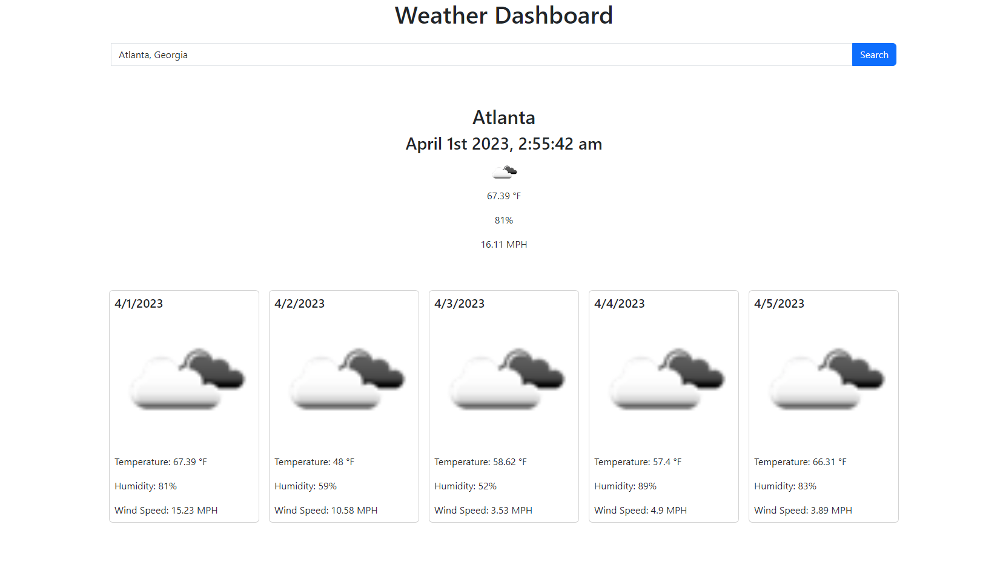

# 5-day Forecast
This is a web application that provides a 5-day weather forecast for any city in the world. It uses the OpenWeatherMap API to retrieve current weather data and forecast information.

## Features
- Search for weather forecasts by city name
- Displays current temperature, humidity, and wind speed
- Displays a 5-day forecast for the selected city

## Technologies Used
- HTML
- CSS
- JavaScript
- Bootstrap 5
- OpenWeatherMap API

## Installation
To use this application, simply visit the live webpage at https://schafiniii.github.io/5-day-forecast/.

If you wish to run this application locally, you can download the source code from the GitHub repository:

    git clone https://github.com/schafiniii/5-day-forecast.git

You will also need to obtain an API key from OpenWeatherMap and replace the apiKey variable in script.js with your own API key.

## Usage
1. Enter the name of the city you wish to search for in the search bar
2. Click the "Search" button
3. The current weather information for the selected city will be displayed
4. Scroll down to see the 5-day forecast for the selected city

## Screenshots

## License
This project is licensed under the MIT License. See the LICENSE file for more information.

